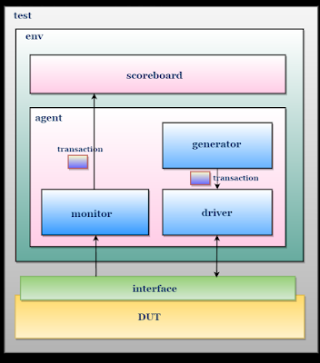

<div align="center">

# ⚡ Intro to SystemVerilog

**Design it. Verify it. Ship it.**

`HDL` · `OOP` · `Constrained-Random` · `Layered TB` · `Coverage` · `UVM-ready`

</div>

---

## 🧠 1. What is SystemVerilog?

**SystemVerilog (SV)** = **HDL + HVL** in one language (IEEE 1800).
It extends Verilog with **OOP, randomization, assertions, and coverage**.

| 🔧 SV for Simulation (Design) | 🧪 SV for Verification |
|---|---|
| Describes **RTL hardware** | Builds **testbenches** that test the RTL |
| `logic`, `always_comb`, `always_ff`, `interface` | `class`, `rand`, `constraint`, `mailbox`, `covergroup` |
| Synthesizable | **Non-synthesizable** (runs only in simulator) |
| Output: hardware (DUT) | Output: confidence + bugs found 🐞 |

> 💡 **One-liner:** *Verilog designs the chip, SystemVerilog **proves** it works.*

---

## ❓ 2. Why SystemVerilog if Verilog Already Exists?

Verilog is great for **design**, weak for **verification**. SV fixes that.

| Feature | Verilog | SystemVerilog |
|---|---|---|
| Paradigm | Procedural | **OOP** (class, inheritance, polymorphism) |
| Reusability | Low (copy-paste) | **High** (reusable classes, packages) |
| Stimulus | Manual / directed | **Constrained-Random (CRV)** |
| Data types | `reg`, `wire` | `logic`, `bit`, `enum`, `struct`, queues, dynamic arrays |
| Communication | Hard-wired ports | **Interface**, `modport`, `mailbox`, `event` |
| Checking | `$display` + eyeballing | **Assertions (SVA)**, scoreboard |
| Coverage | ❌ | **Functional coverage** (`covergroup`) |
| Methodology | None | **UVM** foundation |

---

## 🎯 3. Directed (Static) vs Constrained-Random Testbench

| | 🧱 Directed / Static TB | 🎲 Constrained-Random TB |
|---|---|---|
| Stimulus | Hand-written, fixed | **Randomized within rules** |
| Effort | Linear: 1 test = 1 scenario | Write once, run **thousands** of scenarios |
| Corner cases | Only what you thought of | **Finds unexpected bugs** |
| Reusability | Low | **High** |
| Closure metric | Test count | **Functional coverage %** |
| Best for | Small blocks, sanity tests | **Industry standard** for real designs |

```systemverilog
// Directed                    // Constrained-Random
a = 0; b = 1; #10;             class transaction;
a = 1; b = 1; #10;               rand bit a, b;
                                 constraint c { a dist {0:=1, 1:=3}; }
                               endclass
```

> 💡 **Flow:** Random stimulus → Check (scoreboard) → Measure coverage → Add constraints → Repeat until **100% coverage**.

---

## 🏗️ 4. Testbench Architecture (Layered TB)

<div align="center">

</div>

**Key idea:** Each component has **one job**, so components are **reusable** and **independent** of the DUT.

### 🧩 Components, Job & What They Contain

| Component | 🎯 Job | 📦 Should Contain |
|---|---|---|
| **Transaction** | Data packet (the "unit" of stimulus) | `rand` fields, `constraint`s, `display()` |
| **Generator** | Creates **randomized** transactions | `randomize()`, loop of N items, `mailbox` put → driver |
| **Driver** | Converts transaction → **pin-level signals** | `virtual interface`, `mailbox` get, drive logic |
| **Monitor** | **Passively** samples DUT signals → transaction | `virtual interface`, sampling, `mailbox` put → scoreboard |
| **Agent** | Bundles Generator + Driver + Monitor | Instances of the three, their mailboxes |
| **Scoreboard** | **Checks correctness** (DUT output vs expected) | Reference model, compare logic, PASS/FAIL counters |
| **Environment** | Builds & connects all components | Agent, Scoreboard, mailboxes, `run()` |
| **Test** | Top-level control; picks the scenario | Environment, test config (count, constraints) |
| **Interface** | Signal bundle between TB and DUT | Signals, clock, `modport`/`clocking block` |
| **DUT** | Design under test | RTL only |

> ⚠️ **Interview gold:** Driver **drives**, Monitor **never drives**. Scoreboard checks, it doesn't generate. `virtual interface` is how **classes** (dynamic) reach **module-world** (static) signals.

---

## ➕ 5. Example: Half Adder with Layered TB

**DUT:** `sum = a ^ b`, `carry = a & b`

### 🗺️ Mapping to Architecture

| Component | In Half Adder TB |
|---|---|
| Transaction | `a`, `b` (rand), `sum`, `carry` |
| Generator | Produces random `(a, b)` pairs |
| Driver | Drives `a`, `b` onto the interface |
| Monitor | Samples `a`, `b`, `sum`, `carry` |
| Scoreboard | Checks `sum == a^b` and `carry == a&b` |

### 💻 Code (`half_adder_tb.sv`)

```systemverilog
// ───────────── DUT ─────────────
module half_adder(input logic a, b, output logic sum, carry);
  assign sum   = a ^ b;
  assign carry = a & b;
endmodule

// ───────────── Interface ─────────────
interface ha_if(input logic clk);
  logic a, b, sum, carry;
endinterface

// ───────────── Transaction ─────────────
class transaction;
  rand bit a, b;
  bit sum, carry;
  function void display(string tag);
    $display("[%0t] %-4s | a=%b b=%b | sum=%b carry=%b", $time, tag, a, b, sum, carry);
  endfunction
endclass

// ───────────── Generator ─────────────
class generator;
  mailbox #(transaction) gen2drv;
  int count;
  function new(mailbox #(transaction) gen2drv, int count);
    this.gen2drv = gen2drv;
    this.count   = count;
  endfunction
  task run();
    transaction tr;
    repeat (count) begin
      tr = new();
      assert (tr.randomize());
      gen2drv.put(tr);
    end
  endtask
endclass

// ───────────── Driver ─────────────
class driver;
  virtual ha_if vif;
  mailbox #(transaction) gen2drv;
  function new(virtual ha_if vif, mailbox #(transaction) gen2drv);
    this.vif = vif;
    this.gen2drv = gen2drv;
  endfunction
  task run();
    transaction tr;
    forever begin
      gen2drv.get(tr);
      @(posedge vif.clk);
      vif.a <= tr.a;
      vif.b <= tr.b;
    end
  endtask
endclass

// ───────────── Monitor ─────────────
class monitor;
  virtual ha_if vif;
  mailbox #(transaction) mon2scb;
  function new(virtual ha_if vif, mailbox #(transaction) mon2scb);
    this.vif = vif;
    this.mon2scb = mon2scb;
  endfunction
  task run();
    transaction tr;
    forever begin
      @(posedge vif.clk);
      #1;                               // let driven values + comb logic settle
      tr = new();
      tr.a = vif.a;  tr.b = vif.b;
      tr.sum = vif.sum;  tr.carry = vif.carry;
      mon2scb.put(tr);
    end
  endtask
endclass

// ───────────── Agent ─────────────
class agent;
  generator gen;
  driver    drv;
  monitor   mon;
  function new(virtual ha_if vif, mailbox #(transaction) mon2scb, int count);
    mailbox #(transaction) gen2drv = new();
    gen = new(gen2drv, count);
    drv = new(vif, gen2drv);
    mon = new(vif, mon2scb);
  endfunction
  task run();
    fork
      gen.run();
      drv.run();
      mon.run();
    join_none
  endtask
endclass

// ───────────── Scoreboard ─────────────
class scoreboard;
  mailbox #(transaction) mon2scb;
  int received, pass, fail;
  function new(mailbox #(transaction) mon2scb);
    this.mon2scb = mon2scb;
  endfunction
  task run();
    transaction tr;
    forever begin
      mon2scb.get(tr);
      received++;
      if (tr.sum === (tr.a ^ tr.b) && tr.carry === (tr.a & tr.b)) begin
        pass++;  tr.display("PASS");
      end else begin
        fail++;  tr.display("FAIL");
      end
    end
  endtask
  function void report();
    $display("──────────────────────────────");
    $display(" RESULT: %0d PASS | %0d FAIL", pass, fail);
    $display("──────────────────────────────");
  endfunction
endclass

// ───────────── Environment ─────────────
class environment;
  agent      agt;
  scoreboard scb;
  mailbox #(transaction) mon2scb;
  function new(virtual ha_if vif, int count);
    mon2scb = new();
    agt = new(vif, mon2scb, count);
    scb = new(mon2scb);
  endfunction
  task run();
    fork
      agt.run();
      scb.run();
    join_none
  endtask
endclass

// ───────────── Test ─────────────
class test;
  environment env;
  int count;
  function new(virtual ha_if vif, int count = 8);
    this.count = count;
    env = new(vif, count);
  endfunction
  task run();
    env.run();
    wait (env.scb.received == count);
    env.scb.report();
  endtask
endclass

// ───────────── Top ─────────────
module tb_top;
  logic clk = 0;
  always #5 clk = ~clk;

  ha_if intf(clk);
  half_adder dut(.a(intf.a), .b(intf.b), .sum(intf.sum), .carry(intf.carry));

  test t;
  initial begin
    t = new(intf, 8);
    t.run();
    $finish;
  end
endmodule
```

### ✅ Final Result (sample run, values are random)

```text
[6]  PASS | a=1 b=0 | sum=1 carry=0
[16] PASS | a=1 b=1 | sum=0 carry=1
[26] PASS | a=0 b=0 | sum=0 carry=0
[36] PASS | a=0 b=1 | sum=1 carry=0
[46] PASS | a=1 b=1 | sum=0 carry=1
[56] PASS | a=1 b=0 | sum=1 carry=0
[66] PASS | a=0 b=1 | sum=1 carry=0
[76] PASS | a=1 b=1 | sum=0 carry=1
──────────────────────────────
 RESULT: 8 PASS | 0 FAIL
──────────────────────────────
```

> 🐞 **Try this:** change the DUT to `carry = a | b`. The scoreboard will flag `FAIL` on `a=1,b=0`. That is the whole point of a self-checking TB.

---

## 🔑 6. Interview Quick-Fire

| Question | Short Answer |
|---|---|
| HDL vs HVL? | HDL describes hardware; HVL builds verification environments |
| Why `logic` over `reg`/`wire`? | One 4-state type usable in procedural and continuous assignments |
| Why `interface`? | Bundles signals, cuts port-connection errors, reusable |
| Why `virtual interface`? | Lets classes access static interface signals |
| `mailbox` vs `queue`? | Mailbox = thread-safe, blocking communication between processes |
| `rand` vs `randc`? | `randc` cycles through all values before repeating |
| Why separate Driver & Monitor? | Reusability + passive checking, monitor works even without a driver |
| Directed vs CRV? | Directed = known cases; CRV = scale + corner cases, driven by coverage |
| Code vs Functional coverage? | Code = lines/branches hit; Functional = **features/scenarios** hit |
| What comes after this TB? | Assertions (SVA), covergroups, then **UVM** |

---


<div align="center">

**⭐ Star the repo if it helps your prep. Happy verifying! ⚡**

</div>
